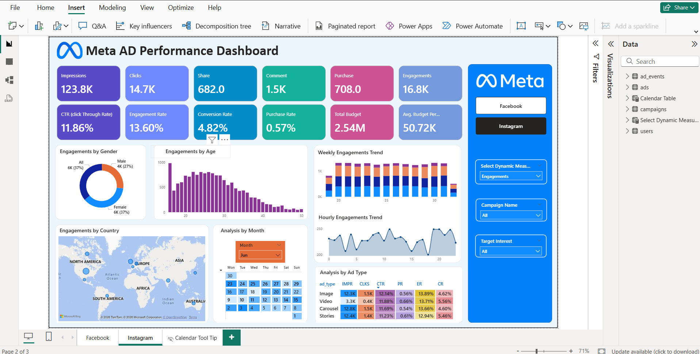
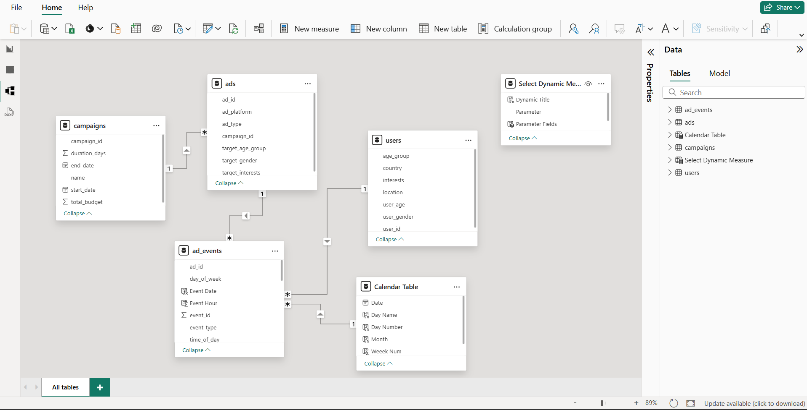
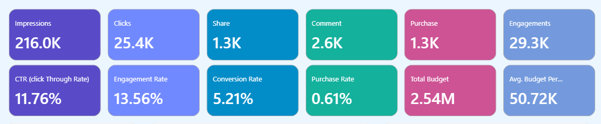
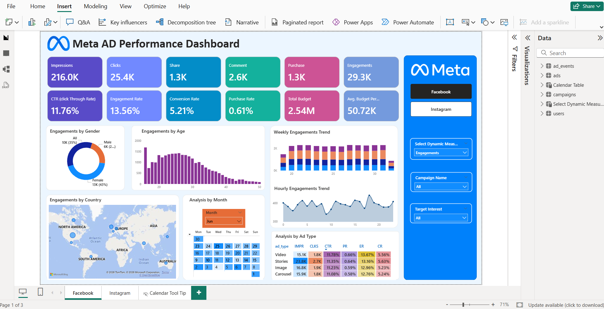
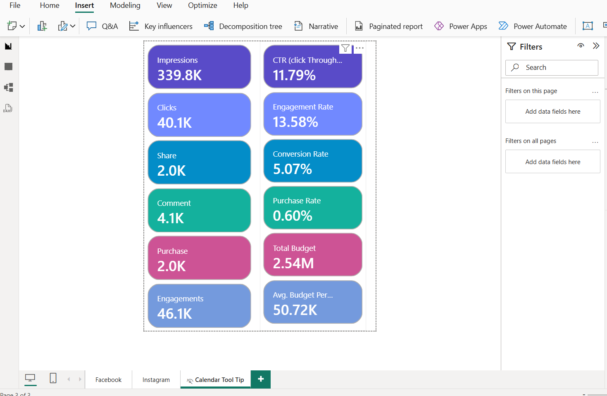
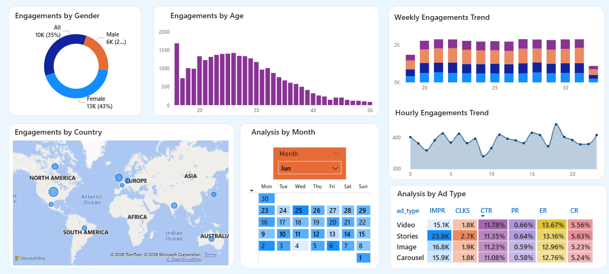

# Meta (Facebook & Instagram) Ad Performance Dashboard

## Project Overview

This project is an end-to-end **Business Intelligence solution** designed to analyze and optimize marketing campaign performance across Facebook and Instagram. 

Using **Microsoft Power BI**, I transformed raw ad event logs into an interactive dashboard that helps marketing managers visualize Key Performance Indicators (KPIs), understand audience demographics, and maximize Return on Ad Spend (ROAS). The project focuses on data modeling, advanced DAX calculations, and user-centric design.

---

## Business Problem & Solution

**The Challenge:** Digital marketing teams often struggle to consolidate data from multiple platforms (Facebook vs. Instagram) to understand real campaign effectiveness. Granular data (timestamps, user IDs) is often locked in CSV files, making it hard to track hourly trends or specific demographic behavior.

**The Solution:** A unified dashboard that allows stakeholders to:
* **Compare Platforms:** A/B test performance between Facebook and Instagram.
* **Optimize Spend:** Identify which campaigns are burning budget vs. generating revenue.
* **Target Effectively:** Drill down into Age, Gender, and Location data to refine audience targeting.
* **Time Analysis:** Analyze peak engagement hours to schedule ads more effectively.

---

## Tech Stack & Methodology

* **Tool:** Microsoft Power BI Desktop
* **Languages:** DAX (Data Analysis Expressions), M Language (Power Query)
* **Data Modeling:** Snowflake Schema (Fact & Dimension tables)
* **ETL Process:** Data cleaning and transformation using Power Query Editor
* **Features Used:** Field Parameters, Bookmarks, Page Navigation, Dynamic Slicers

---

## Key Features & Insights

### 1. Advanced Data Modeling (Snowflake Schema)
Instead of a flat file, I designed a normalized data model to ensure performance and accuracy:

* **Fact Table:** `Ad_Events` (Contains granular transactions: Impressions, Clicks, Purchases).
* **Dimension Tables:** `Ads`, `Campaigns`, `Users` (Demographics), `Calendar` (Date Intelligence).
* **Relationships:** Established One-to-Many relationships to enable accurate filtering.

### 2. Complex DAX Calculations
I implemented custom measures to calculate standard industry metrics, not just sums and counts:

* **CTR (Click-Through Rate):** `DIVIDE(Total Clicks, Total Impressions, 0)`
* **Conversion Rate:** `DIVIDE(Total Purchases, Total Clicks, 0)`
* **Engagement Metrics:** Aggregating likes, comments, and shares to gauge brand sentiment.

### 3. User Experience (UX) Design
* **Page Navigation:** Created a custom navigation bar to switch seamlessly between "Facebook" and "Instagram" views.
* **Field Parameters:** Allows users to dynamically change charts to show *Impressions*, *Clicks*, or *Revenue* without cluttering the dashboard with multiple visuals.
* **Hourly Heatmaps:** A visual analysis of engagement by hour of the day to identify "Golden Hours" for posting.

---

## Dashboard Screenshots

  

### 1. Home Dashboard (Facebook Analysis)
**High-level view of Total Spend, Impressions, and hourly trends.**

### 2. Demographic & Geo Analysis
**Breakdown of performance by Age Group, Gender, and Map visualization.**

---

## Dataset Structure

The data used in this project simulates real-world marketing logs:
* `Ad_Events.csv`: Time-stamped logs of user interactions.
* `Campaigns.csv`: Budget allocation and campaign status.
* `Users.csv`: User demographic details (Age, Gender, Location).
* `Ads.csv`: Creative details (Photo vs. Video, Ad Category).

---

## How to Run

1.  Clone this repository.
2.  Open the `.pbix` file in **Microsoft Power BI Desktop**.
3.  *Note:* If the data source path breaks, go to `Transform Data` > `Data Source Settings` and change the source to the `Dataset/` folder provided in this repo.

---

